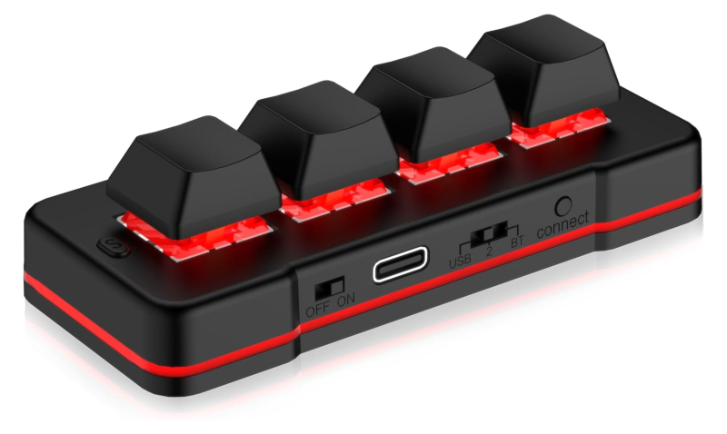

# elfctl

A tiny, dependency-free CLI to reconfigure PCsensor **ElfKey** devices on Linux
— developed against the **MK424BT** 4-key macropad (USB `3553:c140`).



PCsensor's newer devices (VID `3553`) speak the *ElfKey* protocol, which the
popular [`rgerganov/footswitch`](https://github.com/rgerganov/footswitch) tool
does **not** support (it covers `3553:b001` and the older `0c45`/`413d`
pedals). `elfctl` implements the ElfKey protocol directly over raw
`/dev/hidraw` — no `hidapi`, no `libusb`, just a single C file.

## Build

```sh
make
```

## Use

```sh
elfctl list                 # identify the device (model, firmware)
elfctl get                  # show current bindings
elfctl set 1 f13            # set key 1 to F13
elfctl set 2 ctrl-c         # modifiers: ctrl- shift- alt- gui- (r* = right)
elfctl save my.conf         # dump config to a file (or stdout)
elfctl load my.conf         # apply a config file
elfctl keys                 # list every supported key/modifier name
elfctl --version            # print the elfctl version
```

### Binding syntax

A single key with optional modifier prefixes joined by `-` or `+`:

- Keys: `a`–`z`, `0`–`9`, `f1`–`f24`, `enter` `esc` `tab` `space`
  `backspace` arrows (`up`/`down`/`left`/`right`), `home`/`end`/`pageup`/…,
  and common punctuation names (`minus`, `equal`, `slash`, …).
- Modifiers: `ctrl` `shift` `alt` `gui`(=super/win), each with an `r`-prefixed
  right-hand variant (`rctrl`, `ralt`/`altgr`, …).

Examples: `f13`, `ctrl-c`, `shift-tab`, `gui-l`, `ctrl-shift-esc`.

Run `elfctl keys` for the full, authoritative list (it's generated from the
parser's own tables, so it always matches what `set` accepts).

### Config file format

```
# one key per line; blanks and #-comments ignored
key1 = f13
key2 = ctrl-c
key3 = gui-l
key4 = f14
```

## Device access (udev)

The config interface's `hidraw` node is root-only by default. Install the
bundled rule to grant the local user access (matched on `3553:c140`):

```sh
sudo make install-udev      # copies udev/60-elfctl.rules, reloads, re-triggers
```

It uses `uaccess` (logind seat ownership) with a `wheel` group fallback.

## Protocol notes

- Config happens on the **OUT-endpoint HID interface** (`bInterfaceNumber == 1`);
  `elfctl` finds it via sysfs, robust against `hidraw` renumbering.
- The interface declares an **unnumbered** 8-byte report, so each `write()`
  is prefixed with a `0x00` report number (kernel-stripped); the protocol's
  own leading `0x01` is the first payload byte.
- Key read response is framed `[len=0x04, count, modifier, keycode]`. After a
  set, the device emits an ACK report (`byte[0]=0x81`) which `elfctl` skips so
  it always verifies against a real read-back.
- `elfctl` only ever emits read/set-key opcodes (`0x82`/`0x83`/`0x81`). It
  never sends the firmware-flash (`0x20`) or set-model (`0x60`) opcodes that
  also live in this protocol family.

## Status

Single-key and shortcut (modifier+key) bindings work and are verified by
read-back. **Macros / typed strings** (the ElfKey multi-report macro family)
and LED / Bluetooth-name / sleep-timeout settings are not implemented yet.

## Releases

The git tag is the source of truth for the version (`v`-prefixed, e.g.
`v0.1.0`); the bare number is mirrored in `ELFCTL_VERSION` in `elfctl.c` and
reported by `elfctl --version`. Releases are cut with the bundled `/release`
Claude Code skill (`.claude/skills/release/`): `/release patch|minor|major`
bumps the latest tag, drags the macro along, pushes `master`, and creates the
GitHub release with an oldest-first changelog.

## Files

- `elfctl.c` — the tool.
- `probe.c` — minimal read-only protocol probe (diagnostics; `make probe`).
- `experiment.c` — scratch harness for protocol reverse-engineering (`make experiment`).
- `udev/60-elfctl.rules` — device-access rule.
- `.claude/skills/release/` — the `/release` skill.
